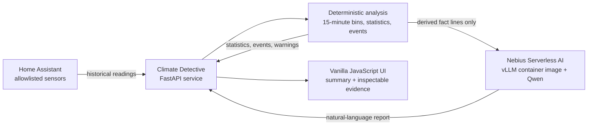

# Climate Detective

**From household sensor history to a story a person can understand.**

Climate Detective is a hackathon proof of concept that investigates temperature, humidity, and
power data from Home Assistant. It detects meaningful changes with deterministic analysis, then
uses a Qwen large language model running on **Nebius Serverless AI** to turn those events into a
short, natural-language report.

The result answers a simple question: _what actually happened at home during this period?_

## The goal

Home automation platforms collect excellent telemetry, but their histories are still charts,
numbers, and timestamps. Understanding a day often means inspecting several graphs and mentally
matching events across them.

Climate Detective compresses that work into one report. A user selects **today**, **yesterday**, or
the **last seven days**, and receives:

- a concise household-friendly summary;
- temperature and humidity statistics;
- estimated energy consumption;
- chronological rises, drops, and power spikes;
- warnings when coverage is incomplete; and
- the derived evidence behind the generated text.

This is deliberately a focused vertical slice: no database, no background jobs, no device control,
and no generic analytics platform. It demonstrates one complete and inspectable AI workflow.

## Why Nebius is central

The language-generation stage runs on Nebius cloud infrastructure. A **vLLM-compatible container
image** deployed as a Nebius Serverless AI interactive endpoint serves a **Qwen instruction model**
through the OpenAI-compatible `/v1/chat/completions` API.

Nebius supplies the on-demand inference environment; Qwen supplies the natural-language layer.
Climate Detective sends the endpoint a compact set of derived fact lines—not raw Home Assistant
history—and receives a readable two-paragraph account.

Two model profiles make the inference layer easy to demonstrate:

- `fast`: Qwen3 0.6B for low-latency generation;
- `strong`: Qwen2.5 7B Instruct for a more capable narrative; and
- a deterministic local fallback if the selected endpoint is unavailable.

The LLM is intentionally **not** asked to calculate statistics or discover events. Those tasks stay
in tested Python code. Qwen is used where it adds the most value: translating structured evidence
into clear language without inventing causes, occupancy, appliance identities, or safety claims.

## Architecture



The processing pipeline is:

1. Resolve the selected calendar period in the home's timezone.
2. Fetch only configured temperature, humidity, and power/energy entities from Home Assistant.
3. Normalize readings and resample them into deterministic 15-minute bins.
4. Calculate coverage and statistics, integrate power into kWh, and detect notable events.
5. Send at most 20 chronological, derived events and measurements to Qwen on Nebius.
6. Return the narrative together with its underlying facts and any data warnings.

The frontend talks only to Climate Detective. Home Assistant and Nebius credentials remain in the
backend environment and are never returned to the browser.

## What the demo shows

1. Open the web interface and choose a period.
2. Climate Detective retrieves real sensor history from Home Assistant.
3. The evidence cards and event timeline show the deterministic result.
4. A Qwen model hosted on Nebius turns the same evidence into a brief report.
5. Open `/api/summary-prompt?period=today` to inspect the exact credential-free request body prepared
   for the model without invoking it.

If Nebius is unavailable, the application still returns the analysis with a local fallback summary
and a visible warning. The demo therefore remains useful while making inference status transparent.

## Technology

- **Nebius Serverless AI** for scalable model inference
- **Qwen** served from a vLLM-compatible container image
- **FastAPI** and `httpx` for the application and integrations
- **Home Assistant REST API** for allowlisted household telemetry
- **Vanilla JavaScript, HTML, and CSS** for a dependency-free frontend
- **Pytest and Ruff** for deterministic tests and code quality

## Run Climate Detective

Prerequisites are Python 3.12+, a Home Assistant long-lived access token, and optionally a deployed
Nebius model endpoint.

```bash
git clone <repository-url>
cd climate-detective
make setup
cp .env.example .env
```

Fill in `.env` with the Home Assistant entity IDs, units, home timezone, and endpoint credentials.
Never commit this file.

For local development:

```bash
make run
```

Open <http://127.0.0.1:8000/>. The API documentation is available at
<http://127.0.0.1:8000/docs>.

To run on port 8080 and accept connections from the local network without changing the Makefile:

```bash
.venv/bin/uvicorn app.main:app \
  --host 0.0.0.0 \
  --port 8080 \
  --env-file .env
```

Then open `http://<server-lan-address>:8080/`. For an internet-facing deployment, place the service
behind an authenticated HTTPS reverse proxy instead of exposing Uvicorn or Home Assistant directly.

## Configure Nebius and Qwen

Deploy the chosen Qwen model in a vLLM-compatible image on a Nebius Serverless AI interactive
endpoint. The container exposes an OpenAI-compatible API, so Climate Detective needs only the base
URL, API key, and model identifier.

```dotenv
NEBIUS_PROFILE=strong

NEBIUS_FAST_BASE_URL=https://<fast-endpoint>/v1
NEBIUS_FAST_API_KEY=<fast-endpoint-token>
NEBIUS_FAST_MODEL=Qwen/Qwen3-0.6B

NEBIUS_STRONG_BASE_URL=https://<strong-endpoint>/v1
NEBIUS_STRONG_API_KEY=<strong-endpoint-token>
NEBIUS_STRONG_MODEL=Qwen/Qwen2.5-7B-Instruct
```

Switch `NEBIUS_PROFILE` between `fast` and `strong` without moving credentials. The application
automatically appends `/v1` when needed. If the selected profile has no API key or model, it uses
the deterministic fallback summary.

The public endpoint port must match the port on which vLLM listens inside the deployed image. For
example, an endpoint exposing port 8080 must start the model server on port 8080:

```bash
python3 -m vllm.entrypoints.openai.api_server \
  --model Qwen/Qwen2.5-7B-Instruct \
  --host 0.0.0.0 \
  --port 8080 \
  --max-model-len 32768
```

Stop or delete the Nebius endpoint after the demonstration to avoid ongoing compute charges.

## API

```http
GET /api/health
GET /api/home-sensors
GET /api/summary?period=today
GET /api/summary?period=yesterday
GET /api/summary?period=last_7_days
GET /api/summary-prompt?period=today
```

`/api/home-sensors` returns current readings for the fixed sensor allowlist. An error from one sensor
does not hide successful readings from the others.

`/api/summary` returns the generated summary, resolved interval, statistics, events, units, warnings,
and generation timestamp. Responses are cached briefly to limit repeated private-network reads and
paid inference during a demonstration.

`/api/summary-prompt` returns the exact OpenAI-compatible JSON body that would be sent to Nebius. It
contains derived facts only, with no credentials or raw sensor samples.

## Reliability, privacy, and safety

- Entity IDs are configured on the server and cannot be selected by browser input.
- Raw telemetry is analyzed locally; only compact derived facts are sent to Nebius.
- Missing, unavailable, duplicate, or non-numeric readings are handled deterministically.
- Power in watts is time-integrated and reported as energy in kWh.
- The LLM receives explicit units and timestamps and is instructed to use supplied facts only.
- Inference failure does not fail the report; a deterministic fallback is returned with a warning.
- The application is read-only and never calls Home Assistant service or action endpoints.

For the safest demo, run Climate Detective on the same private network as Home Assistant. Never
port-forward Home Assistant's port 8123 for this application. Use dedicated, revocable credentials,
TLS, rate limiting, and access control for any public deployment.

## Verify the project

```bash
make check
```

This runs Ruff linting, a formatting check, and the complete test suite. Tests use synthetic readings
and mocked integrations; they never contact a real home or a live Nebius endpoint.

See [AGENTS.md](AGENTS.md) for the detailed design constraints and
[hackathon-demo-guide.md](hackathon-demo-guide.md) for the presentation walkthrough.
